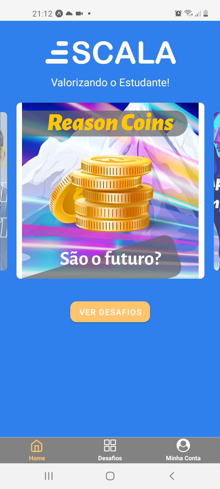
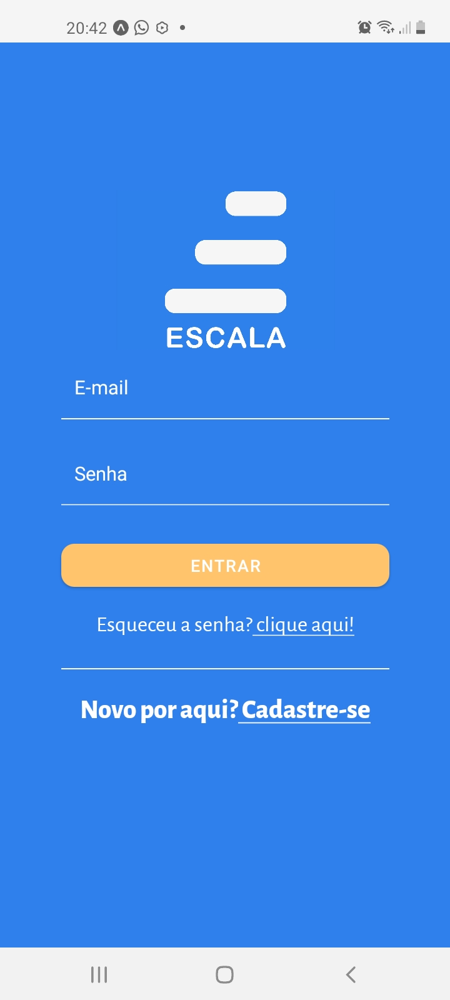
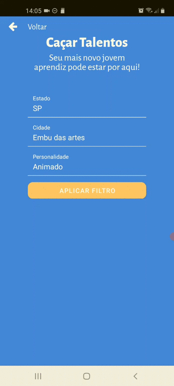
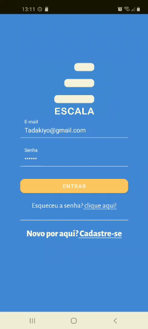

<h1 align="center">
    
</h1>

<p align="center"> 
  O projeto tem o objetivo de diminuir o índice de evasão escolar, os principais motivos que identificamos foi a falta de motivação e a necessidade de arrumar um emprego, por isso criamos uma plataforma que permite as escolas cadastrarem seus professores e turmas, os professores ficam responsáveis por cadastrar os alunos e os desafios para eles realizarem, eles são recompensados por Reason Coin(moeda virtual), e uma oportunidade de serem vistos pelas empresas, já que as empresas conseguem realizar uma busca customizada por filtros, procurando estudantes com o perfil respectivo a vaga.
</p>

## :iphone: Aplicativo
  <table>
    <tr>
      <th width="50%">
        Landing
      </th>
      <th width="50%">
        Login
      </th>
    </tr>
    <tr>
      <td>
          
      </td>
      <td>
      
    </td>
    </tr>
  </table>

<table>
  <tr>
    <th width="33.3%">
      Empresas (Filtro) 
    </th>
    <th width="33.3%">
      Aluno (Transação)
    </th>
    <th width="33.3%">
      Estudar (Favoritos)
    </th>
  </tr>
  <tr>
    <td>
      
    </td>
    <td>
        
    </td>
    <td>
        
    </td>
  </tr>
</table>


## :bulb: Principais funcionalidades

* Cadastrar Turmas, Professores, Alunos e Desafios.

* Validar os Desafios

* Trocar Pontos por Reason Coin(moeda virtual).

## :wrench: Pré-requisitos

 Antes de começar, você vai precisar ter instalado em sua máquina as seguintes ferramentas:
[Git](https://git-scm.com), [Node.js](https://nodejs.org/en/) e o [Expo](https://expo.io/). 
Além disto é bom ter um editor para trabalhar com o código como o [VSCode](https://code.visualstudio.com/)

## :rocket: Para rodar a aplicação

```bash

# Clone este repositório
$ git clone https://github.com/Gabriel52/SchoolChallenge.git

# Acesse a pasta do projeto no seu terminal/cmd
$ cd SchoolChallenge-master

# Execute o comando nas pastas microservices/server/mobile para instalar todas as dependências
$ npm install ou yarn

# Primeiro rode este comando no microservices, server depois mobile
$ npm start ou yarn start

# Para rodar o aplicativo é preciso instalar o Expo  no seu celular,
# quando você rodar a aplicação Mobile com o comando yarn start, o seu navegador
# irá abrir mostrando um QrCode, abra o Expo no seu celular, e clique na opção
# "Scan QR Code", aponte a câmera para o QrCode e aproveite para fazer testes no Escala

```

## 🛠 Tecnologias

  * [Node.js](https://nodejs.org/en/) (Back-End);

  * [React-Native](https://reactnative.dev/) (Mobile Front-End);

  * [Expo](https://expo.io/) (Rodar o projeto);

<h2> :book: Licença </h2>
<p>Lançado em 2020 :book:</p></br>
<p>Feito pela equipe 25 Hackathon :rocket:. Este projeto está sobre a licença do MIT</p></br>
<p>Dar uma :star: se este projeto te ajudou</p>
